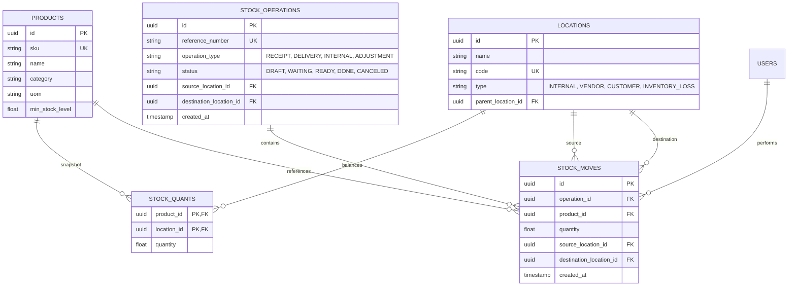

# StockSense — High-Concurrence, Zero-License-Cost Inventory & Ledger Engine

StockSense is an enterprise-grade Inventory & Warehouse Management System (IMS) and Double-Entry Ledger Engine built according to the **StockSense Backend Architecture Specification** and **StockSense Problem Statement**.

The engine strictly implements **Odoo-grade double-entry stock bookkeeping**, an **isolated atomic validation engine** preventing negative inventory, **Redis-backed transient KPI and OTP caching**, a **FastAPI async REST API (/api/v1)** with interactive **OpenAPI Swagger documentation (/docs)**, and a full-featured **interactive Web UI (/)**.

---

## 1. Executive Summary & Design Highlights

* **Architecture**: Modular Monolith / Native Async ASGI Engine (FastAPI + Uvicorn + WSGI bridge for UI).
* **Double-Entry Ledger Model**: Inventory quantities are **never** mutated via uncontrolled scalar mutations. Every stock change is modeled as a balanced movement from a *Source Location* to a *Destination Location*.
* **Zero License Cost**: 100% Free & Open Source stack (FastAPI, PostgreSQL 16, Redis 7, Caddy 2).
* **Isolation & Negative Stock Prevention**: Row-level verification (`SELECT ... FOR UPDATE` isolation semantics) ensuring no outbound delivery order can ever force inventory negative.
* **Interactive API Documentation**: Live interactive Swagger UI at `/docs` and ReDoc at `/redoc`.
* **Background Alerting Engine**: Scheduled cron worker scanning for items below `min_stock_level` every 15 minutes and dispatching digests.

---

## 2. Technology Stack Matrix

| Layer | Chosen Technology | License / Model | Architectural Role |
| :--- | :--- | :--- | :--- |
| **Core API Engine** | **FastAPI + Uvicorn** | MIT / Free OSS | Native async execution, high concurrency, automatic OpenAPI schemas, Pydantic type validation. |
| **Web UI Engine** | **Flask 3 + Google Stitch** | BSD / Free OSS | Full dashboard, receipts, delivery orders, transfers, adjustments, and ledger screens. |
| **Primary Relational Store** | **PostgreSQL 16** (or SQLite for local dev) | PostgreSQL / Public | Strict ACID guarantees, row-level locking for atomic inventory validation. |
| **In-Memory Cache** | **Redis 7** (with transparent memory fallback) | BSD-3 / Free OSS | Instant OTP token verification (10-min TTL), transient 60-second KPI counter caching. |
| **Worker / Alerting** | **Python Worker Daemon** | MIT / Free OSS | Automated scanning of products below minimum stock thresholds and alert digest dispatch. |
| **Edge Proxy & TLS** | **Caddy Web Server 2** | Apache 2.0 | Automatic zero-configuration SSL termination and reverse proxy. |

---

## 3. Double-Entry Inventory Database Schema

StockSense follows Odoo-grade inventory best practices:



### Location Types
1. **INTERNAL**: Physical warehouse storage bins and racks (e.g., `MAIN/STOCK`, `MAIN/PROD`, `MAIN/RACK-A`).
2. **VENDOR**: Virtual supplier origin point for inbound receipts (`PARTNERS/VENDORS`).
3. **CUSTOMER**: Virtual consumption destination for customer dispatches (`PARTNERS/CUSTOMERS`).
4. **INVENTORY_LOSS**: Virtual balancing location for shrinkage, scrap, and physical count discrepancies (`VIRTUAL/LOSS`).

---

## 4. Atomic Stock Validation Engine

```
                          ┌───────────────────────────┐
                          │   Operation Validation    │
                          └─────────────┬─────────────┘
                                        │
                 ┌──────────────────────┴──────────────────────┐
                 ▼                                             ▼
       Inbound (Receipts)                            Outbound (Deliveries)
┌─────────────────────────────────┐           ┌─────────────────────────────────┐
│ Source: VENDOR                  │           │ Row-level lock on Source Quant  │
│ Increment Destination Quant     │           │ Check: Available >= Requested?   │
│ Append to Immutable Stock Moves │           └──────────────┬──────────────────┘
└─────────────────────────────────┘                          │
                                             ┌───────────────┴───────────────┐
                                             ▼                               ▼
                                          [YES]                            [NO]
                              ┌───────────────────────────┐     ┌────────────────────────┐
                              │ Decrement Source Quant    │     │ ABORT Transaction      │
                              │ Append to Stock Moves     │     │ HTTP 400 Insufficient │
                              │ Status -> DONE            │     │ Stock (No Negative Qty)│
                              └───────────────────────────┘     └────────────────────────┘
```

* **Negative Stock Prevention**: An outbound order or internal transfer cannot complete if available inventory at the source location is less than the requested quantity.
* **Transient KPI Cache Invalidation**: Any stock-altering transition immediately evicts the cached KPI snapshot in Redis, ensuring dashboard metrics remain 100% consistent.

---

## 5. REST API Surface (`/api/v1`)

| Method | Endpoint | Auth & RBAC | Description |
| :--- | :--- | :--- | :--- |
| `POST` | `/api/v1/auth/otp-request` | Public | Generates 6-digit OTP stored in Redis with a 10-minute TTL. |
| `POST` | `/api/v1/auth/reset-password`| Public | Verifies OTP and updates password using Argon2 encryption. |
| `POST` | `/api/v1/auth/login` | Public | Authenticates credentials and returns JWT bearer token. |
| `POST` | `/api/v1/auth/register` | Public | Registers a new manager or staff member. |
| `GET`  | `/api/v1/auth/me` | Authenticated | Returns current authenticated profile and permissions. |
| `GET`  | `/api/v1/dashboard/kpis` | Authenticated | Returns aggregated cached metrics (Total products, Low Stock, Pending operations). |
| `GET`  | `/api/v1/operations` | Authenticated | Filtered query by status, type (Receipt, Delivery, Internal, Adjustment), warehouse. |
| `POST` | `/api/v1/operations` | Authenticated | Creates a new operation with line items. |
| `GET`  | `/api/v1/operations/{id}` | Authenticated | Returns complete operation details and line items. |
| `POST` | `/api/v1/operations/{id}/validate` | Manager/Staff | Executes atomic state shift from READY to DONE and mutates ledger & quants. |
| `POST` | `/api/v1/operations/{id}/action` | Manager/Staff | State transitions: `confirm`, `pick`, `pack`, `cancel`. |
| `GET`  | `/api/v1/ledger/moves` | Authenticated | Audit trail pagination of historical double-entry ledger move records. |
| `GET`  | `/api/v1/products` | Authenticated | Catalog with dynamically calculated on-hand, available, and reserved stock. |
| `POST` | `/api/v1/products` | Manager | Creates a new product with optional opening stock. |
| `GET`  | `/api/v1/products/{id}` | Authenticated | Product detail with per-location stock breakdown matrix. |
| `PUT`  | `/api/v1/products/{id}` | Manager | Updates product reorder levels and metadata. |
| `GET`  | `/api/v1/locations` | Authenticated | Lists physical and virtual locations by type. |
| `POST` | `/api/v1/locations` | Manager | Creates physical or virtual location. |
| `GET`  | `/api/v1/alerts/low-stock` | Authenticated | Scans for products below min_stock_level and produces alert digest. |
| `POST` | `/api/v1/alerts/dispatch-digest` | Authenticated | Dispatches low-stock alert notifications to inventory managers. |
| `GET`  | `/health` | Public | System health check and architecture status. |

---

## 6. Demo Accounts & RBAC Matrix

| Name | Role | Email | Password | Allowed Scope |
| :--- | :--- | :--- | :--- | :--- |
| **Ridhima Sharma** | `INVENTORY_MANAGER` | `manager@stocksense.demo` | `Manager@2026` | Full system access: catalog creation, facility setup, sign-offs, ledger audit, adjustments. |
| **Aman Kumar** | `WAREHOUSE_STAFF` | `staff@stocksense.demo` | `Staff@2026` | Floor operations: receiving intake, picking, packing, internal moves, blind cycle count. |
| **Neha Joshi** | `WAREHOUSE_STAFF` | `neha.joshi@stocksense.demo` | `Staff@2026` | Floor operations: receiving intake, picking, packing, internal moves, blind cycle count. |

---

## 7. Running Locally (Quickstart)

### 1. Prerequisites
- Python 3.10+ (tested on Python 3.11, 3.12, 3.14)
- Git

### 2. Setup Virtual Environment & Install Dependencies
```bash
git clone git@github.com:ridhimasharma02/Hackathonn2.git
cd Hackathonn2

python -m venv .venv
# Windows:
.venv\Scripts\activate
# Linux/macOS:
source .venv/bin/activate

pip install -r requirements.txt
```

### 3. Initialize & Seed Database
```bash
python seed.py
```
This initializes the database with:
- 3 User accounts
- 2 Physical Warehouses (`MAIN`, `WH2`) and 3 Virtual Locations (`VENDORS`, `CUSTOMERS`, `LOSS`)
- 8 Products with calibrated inventory states (1 out-of-stock, 2 low-stock, 5 in-stock)
- 25-day realistic transaction history and synchronized double-entry quants.

### 4. Start Unified Server
```bash
python run.py
```
This launches the unified ASGI server on port **5001**:
* **Web UI Dashboard**: [http://localhost:5001/](http://localhost:5001/)
* **Interactive Swagger API Docs**: [http://localhost:5001/docs](http://localhost:5001/docs)
* **ReDoc API Documentation**: [http://localhost:5001/redoc](http://localhost:5001/redoc)
* **OpenAPI Specification**: [http://localhost:5001/openapi.json](http://localhost:5001/openapi.json)
* **System Health Check**: [http://localhost:5001/health](http://localhost:5001/health)

### 5. Running the Background Alerting Worker
To run a one-time audit scan:
```bash
python worker.py --once
```
To run the continuous 15-minute daemon loop:
```bash
python worker.py --interval 900
```

---

## 8. Production Deployment (Docker Compose)

Deploy the entire zero-license stack (FastAPI Backend, PostgreSQL 16, Redis 7, Caddy with Auto-TLS) with a single command:

```bash
docker compose up --build -d
```

### Services Deployed:
* `caddy`: Auto-TLS edge proxy on ports 80 & 443.
* `backend`: FastAPI + ASGI backend running on port 8000.
* `postgres`: PostgreSQL 16 Alpine with isolated volume persistence (`pgdata`).
* `redis`: Redis 7 Alpine with persistent storage (`redisdata`).

---

## 9. Test Suite Verification

Run the comprehensive pytest suite covering both the FastAPI `/api/v1` REST engine and acceptance workflow tests:

```bash
pytest -v
```

### Test Coverage Highlights:
- **System**: Health endpoints and OpenAPI specification validation.
- **Security & RBAC**: JWT issue, token verification, role enforcement (staff blocked from manager endpoints), Argon2 password hashing.
- **OTP Engine**: 6-digit numeric generation, Redis caching, 10-minute TTL expiry, and password reset.
- **Double-Entry Ledger & Quants**: Inbound receipts incrementing stock, internal relocations maintaining total balance, and immutable ledger moves.
- **Integrity Validation**: Outbound delivery attempts exceeding available stock strictly abort with HTTP 400 (no negative stock).
- **Background Worker & Alerts**: Automated scans correctly flagging critical out-of-stock and low-stock warnings.

---

## 10. License & Attribution

StockSense is released under the **MIT Open Source License**. Developed for the StockSense Warehouse Management Hackathon.
